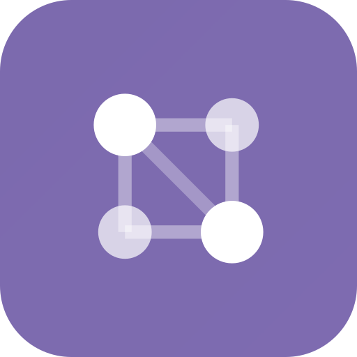
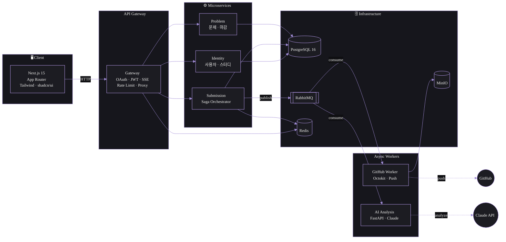

# 알고리즘 스터디 관리 플랫폼 | 코드 제출부터 AI 분석까지

<div align="center">
  
  <h1>AlgoSu</h1>
  <p><strong>알고리즘 스터디 관리 플랫폼</strong> — 코드 제출부터 AI 분석까지 자동화된 워크플로우</p>

  [](https://github.com/tpals0409/AlgoSu/actions/workflows/ci.yml)
  
  
  

  🔗 [**algo-su.com**](https://algo-su.com)
</div>

---

## 주요 기능

- **OAuth 소셜 로그인** — Google · Naver · Kakao 3사 OAuth + httpOnly Cookie JWT 인증
- **코드 제출 → GitHub 자동 Push** — 제출 즉시 GitHub 레포지토리에 자동 커밋 (GitHub App 연동)
- **AI 코드 분석** — Claude API 기반 코드 리뷰 · 점수 산정 · 피드백 자동 생성 (Circuit Breaker 적용)
- **스터디 관리** — 문제 출제 · 마감 자동 종료 · 난이도 티어 시스템 · 스터디룸 대시보드
- **실시간 알림** — SSE(Server-Sent Events) 기반 제출 상태 · 분석 완료 실시간 푸시

---

## 데모

> 🎮 **체험형 데모 계정 준비 중**

---

## 기술 스택

| 서비스 | 역할 | 기술 |
|--------|------|------|
| **Gateway** | API Gateway · OAuth · JWT · SSE | NestJS 10 · Passport · ioRedis · Throttler · Swagger |
| **Submission** | 제출 관리 · Saga Orchestrator | NestJS 10 · TypeORM · RabbitMQ (amqplib) |
| **Problem** | 문제 CRUD · 마감 스케줄러 | NestJS 10 · TypeORM · @nestjs/schedule |
| **Identity** | 사용자 · 스터디 DB | NestJS 10 · TypeORM · PostgreSQL |
| **GitHub Worker** | RabbitMQ Consumer · GitHub Push | Node.js · Octokit (GitHub App) · amqplib |
| **AI Analysis** | Claude API · Circuit Breaker | FastAPI · Anthropic SDK · pika · httpx |
| **Frontend** | SPA · 대시보드 · 코드 에디터 | Next.js 15 (App Router) · React 19 · Tailwind 4 · shadcn/ui · Monaco Editor |

| 인프라 | 기술 |
|--------|------|
| 오케스트레이션 | k3s (프로덕션) · k3d (개발) |
| CI/CD | GitHub Actions (15 jobs) → GHCR → ArgoCD GitOps |
| DB | PostgreSQL 16 (Database per Service) |
| 메시지 큐 | RabbitMQ 3.13 |
| 캐싱 | Redis 7.2 |
| 객체 저장소 | MinIO |
| 모니터링 | Prometheus · Grafana · AlertManager |
| 보안 | SealedSecret · NetworkPolicy · Gitleaks |

---

## 아키텍처



---

## 디렉토리 구조

```
AlgoSu/
├── frontend/                  # Next.js 15 (App Router, Tailwind, shadcn/ui)
├── services/
│   ├── gateway/               # API Gateway · OAuth · JWT · SSE
│   ├── submission/            # 제출 관리 · Saga Orchestrator
│   ├── problem/               # 문제 CRUD · 마감 스케줄러
│   ├── identity/              # 사용자 · 스터디 DB
│   ├── github-worker/         # RabbitMQ Consumer · GitHub Push
│   └── ai-analysis/          # Claude API · Circuit Breaker
├── infra/
│   ├── k3s/                   # K8s 매니페스트 (HPA, PDB, NetworkPolicy)
│   ├── overlays/              # Kustomize (dev / staging / prod)
│   └── sealed-secrets/        # SealedSecret 암호화
├── scripts/                   # 배포 · 검증 스크립트
├── .github/workflows/         # CI 파이프라인 (15 jobs)
└── docs/                      # ADR · 런북 · 규칙 문서
```

---

## 시작하기

### 사전 요구사항

- Docker & Docker Compose
- Node.js 20+
- Python 3.12+
- pnpm (프론트엔드)

### 1. 인프라 실행

```bash
# 저장소 클론
git clone https://github.com/tpals0409/AlgoSu.git
cd AlgoSu

# 환경 변수 설정
cp .env.example .env
# .env 파일에 PostgreSQL, Redis, RabbitMQ 비밀번호 입력

# 인프라(PostgreSQL, Redis, RabbitMQ) 실행
docker compose -f docker-compose.dev.yml up -d
```

### 2. 백엔드 서비스 실행

```bash
# 각 서비스 디렉토리에서 .env.example을 참고하여 .env 설정
# 예: services/gateway/.env.example → services/gateway/.env

# 서비스 실행 (각 서비스 디렉토리에서)
cd services/gateway && npm install && npm run start:dev
cd services/identity && npm install && npm run start:dev
cd services/problem && npm install && npm run start:dev
cd services/submission && npm install && npm run start:dev
cd services/github-worker && npm install && npm run start:dev
cd services/ai-analysis && pip install -r requirements.txt && uvicorn main:app --reload
```

### 3. 프론트엔드 실행

```bash
cd frontend
pnpm install
pnpm dev
# http://localhost:3000 접속
```
