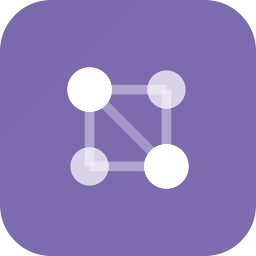
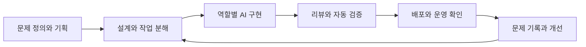
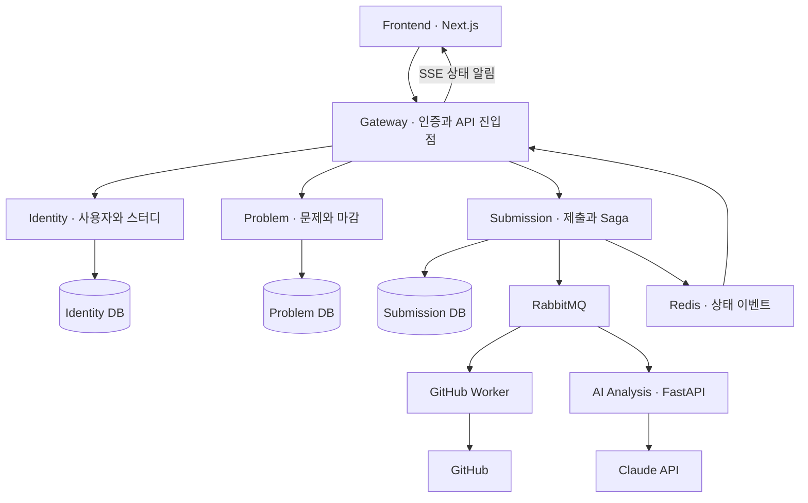
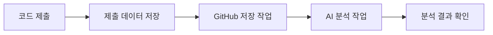

  
  <h1>AlgoSu</h1>
  
<strong>코드 제출부터 GitHub 저장, AI 코드 분석까지 이어지는 알고리즘 스터디 관리 서비스</strong>

  

    <a href="https://algo-su.com">서비스 바로가기</a> ·
    <a href="https://algo-su.com/login">데모 체험</a> ·
    <a href="blog/content/posts">개발 기록</a>
  

<!-- 대표 화면 캡처: 스터디 현황과 주요 기능이 드러나는 실제 화면을 추가합니다. -->

## 1. 프로젝트 소개

AlgoSu는 알고리즘 스터디의 문제 관리, 코드 제출, GitHub 저장, AI 피드백을 한곳에서 연결하는 서비스입니다. 스터디 진행 상황을 확인하고, 제출한 코드를 기록하며, 분석 결과를 바탕으로 풀이를 돌아볼 수 있습니다.

AI Native Builder를 지향하며, **기획부터 개발, 배포, 운영과 유지보수까지 혼자 맡고 있습니다.** 서비스의 코드 분석 기능뿐 아니라 제품을 설계하고 구현하며 개선하는 과정에도 AI를 적극적으로 활용하고 있습니다.

| 항목 | 내용 |
| --- | --- |
| 개발 형태 | 1인 개발 |
| 담당 범위 | 기획 · 설계 · 프론트엔드 · 백엔드 · 인프라 · 운영 및 유지보수 |
| 서비스 상태 | 운영 및 유지보수 중 |
| AI 활용 | 서비스 내 코드 분석, 개발 과정의 역할별 작업 분담과 구현·검증 |

<!-- 보완: 개발 기간과 서비스를 처음 만들게 된 개인적인 계기를 작성합니다. -->

## 2. 주요 기능과 화면

### 스터디 관리

스터디에서 풀 문제와 마감을 정하고, 멤버와 진행 상황을 대시보드에서 확인합니다. 문제별 난이도와 제출 내역을 함께 살펴볼 수 있습니다.

<!-- 화면 캡처: 스터디룸 대시보드와 문제 목록 -->

### 코드 제출과 GitHub 자동 저장

제출한 코드를 연결된 GitHub 저장소에 자동으로 커밋합니다. 풀이 이력을 남기고, 제출 화면에서 저장 작업의 진행 상태를 확인할 수 있습니다.

<!-- 화면 캡처 또는 GIF: 코드 제출 → 처리 상태 → GitHub 저장 결과 -->

### AI 코드 분석과 피드백

Claude API로 제출 코드를 분석하고 리뷰와 피드백을 제공합니다. 분석 결과 화면에서 점수와 항목별 피드백을 확인하며 자신의 풀이를 돌아볼 수 있습니다.

<!-- 화면 캡처: AI 분석 결과와 항목별 피드백 -->

## 3. AI를 활용한 개발 과정

### 역할과 책임을 나누는 방식

서비스의 경계, 통신 방식, 인증과 배포 방향을 정하고, AI 에이전트에 역할별 구현 작업을 맡겼습니다. Gateway의 인증과 보안, Submission의 제출 흐름, 데이터베이스 스키마처럼 담당 영역을 나누어 각 작업에 필요한 맥락을 좁혔습니다.

AI가 구현하는 세부 로직과 직접 내린 설계 판단을 구분해 기록했습니다. 예를 들어 외부 API 작업을 비동기로 처리한다는 방향을 정한 뒤, 상태 전이와 재시도 같은 구현을 AI와 구체화했습니다.

### 구현과 검증을 연결하는 방식

```mermaid
flowchart LR
    A[문제 정의와 기획] --> B[설계와 작업 분해]
    B --> C[역할별 AI 구현]
    C --> D[리뷰와 자동 검증]
    D --> E[배포와 운영 확인]
    E --> F[문제 기록과 개선]
    F --> B
```

구현 결과는 리뷰와 CI를 거쳐 확인합니다. 린트, 타입 검사, 테스트, 보안 검사를 개발 흐름에 포함하고, 주요 결정과 시행착오는 ADR과 개발 기록으로 남깁니다.

- [AI와 함께한 아키텍처 설계](blog/content/posts/system-architecture-overview.mdx)
- [AI 생성 코드를 검증하는 CI/CD 구축 과정](blog/content/posts/cicd-ai-guardrails.mdx)
- [실제 CI 구성](.github/workflows/ci.yml)

## 4. 시스템 아키텍처

아래 구성도는 주요 서비스의 책임과 통신 관계를 요약한 그림입니다.

```mermaid
flowchart TB
    FE[Frontend · Next.js] --> GW[Gateway · 인증과 API 진입점]
    GW --> ID[Identity · 사용자와 스터디]
    GW --> PROB[Problem · 문제와 마감]
    GW --> SUB[Submission · 제출과 Saga]
    ID --> IDDB[(Identity DB)]
    PROB --> PDB[(Problem DB)]
    SUB --> SDB[(Submission DB)]
    SUB --> MQ[RabbitMQ]
    MQ --> GH[GitHub Worker]
    MQ --> AI[AI Analysis · FastAPI]
    GH --> EXTGH[GitHub]
    AI --> CLAUDE[Claude API]
    SUB --> REDIS[Redis · 상태 이벤트]
    REDIS --> GW
    GW -->|SSE 상태 알림| FE
```

Gateway는 인증과 요청 전달을 맡고, Identity·Problem·Submission은 각 도메인의 데이터와 기능을 관리합니다. GitHub 저장과 AI 분석은 별도 워커에서 처리하며, 제출 상태 변화는 Redis와 SSE를 통해 사용자에게 전달합니다.

### 코드 제출 한 건의 흐름

```mermaid
flowchart LR
    A[코드 제출] --> B[제출 데이터 저장]
    B --> C[GitHub 저장 작업]
    C --> D[AI 분석 작업]
    D --> E[분석 결과 확인]
```

위 그림은 정상 처리 경로를 요약합니다. Submission의 Saga가 단계별 상태를 관리하며, 외부 작업의 지연이나 실패에 대응하는 재시도·복구 로직을 둡니다.

### 주요 기술

| 영역 | 기술 |
| --- | --- |
| 프론트엔드 | Next.js · React · TypeScript · Tailwind CSS · Monaco Editor |
| 백엔드 | NestJS · TypeORM · FastAPI |
| 데이터와 비동기 처리 | PostgreSQL · Redis · RabbitMQ |
| 외부 연동 | GitHub App · Claude API |
| 배포와 운영 | GitHub Actions · GHCR · ArgoCD · k3s · Prometheus · Grafana |

## 5. 개발 철학과 설계 결정

### 책임을 나누고, 경계를 실제 구현에 반영합니다

서비스를 나눌 때 데이터 소유권과 AI 에이전트의 작업 범위를 함께 고려했습니다. 담당 영역이 명확해지는 대신, 서비스 간 통신과 분산 상태 관리의 복잡성을 감수했습니다.

초기에는 Gateway가 Identity 데이터베이스에 직접 접근하는 부분이 남아 있었습니다. 이를 Identity API 호출로 옮겨 서비스 경계를 구현에 반영했습니다. 이 과정에서 내부 HTTP 호출과 장애 의존성이 추가되는 비용도 검토했습니다.

[Gateway와 Identity의 데이터 접근 분리 — ADR-001](docs/adr/ADR-001-gateway-identity-db-separation.md)

### 오래 걸리는 작업은 분리하고, 실패 이후의 흐름도 설계합니다

GitHub 저장과 AI 분석을 요청 안에서 모두 기다리게 하면 외부 API의 응답 시간이 사용자 경험에 그대로 영향을 줍니다. 두 작업을 비동기로 분리하고, 사용자는 제출 후 진행 상태를 확인하도록 구성했습니다.

비동기 처리에는 중복 실행과 미완료 작업을 다루는 책임이 따릅니다. 상태 전이, 타임아웃, 재시도와 복구를 제출 흐름의 일부로 다룹니다.

[제출 상태 관리와 복구 구현](services/submission/src/saga)

### AI의 결과를 검증할 수 있는 개발 환경을 만듭니다

AI가 작성한 코드를 지속적으로 반영하려면 결과를 확인하는 절차도 반복할 수 있어야 합니다. 코드 품질과 테스트, 보안 검사를 CI에 포함하고, 배포 과정에서 발견한 문제를 개발 규칙과 검증 절차에 반영해왔습니다.

[CI/CD 구축 과정과 시행착오](blog/content/posts/cicd-ai-guardrails.mdx)

## 6. 운영과 유지보수

### 배포와 관측

GitHub Actions에서 이미지를 빌드하고 GHCR에 저장한 뒤, GitOps 저장소와 ArgoCD를 통해 k3s 환경에 배포하는 흐름을 사용합니다. Prometheus와 Grafana를 운영 상태를 관측하는 도구로 활용합니다.

### 배포 완료를 실제 동작으로 확인하기

운영 중 헬스 체크 회귀와 환경변수 누락으로 새 버전의 롤아웃이 진행되지 않는 문제가 있었습니다. 기존 Pod가 요청을 처리하고 있어 서비스 접속만으로는 새 버전의 배포 실패를 알아차리기 어려웠습니다.

헬스 체크 경로 처리와 누락된 설정을 수정하고, SealedSecret을 다시 봉인해 복구했습니다. 이 과정에서 드러난 알림과 배포 절차의 공백은 후속 과제로 기록했습니다. **서비스에 접속할 수 있는지와 의도한 버전이 정상 동작하는지는 별도로 확인해야 한다**는 운영상의 교훈을 얻었습니다.

[롤아웃 실패의 원인과 복구 기록 — ADR-026](docs/adr/ADR-026-sprint-130-incident-stuck-rollouts-and-sealed-secrets-debt.md)

<!-- 보완: 사용자 피드백을 반영한 사례와 운영·유지보수에서 AI를 활용한 구체적인 사례 -->

## 7. 회고와 개선 방향

AlgoSu를 만들며 AI에 일을 맡기는 범위와 서비스의 책임 경계를 함께 설계했습니다. 역할을 나눈 만큼 서비스 간 통신과 배포를 관리하는 부담도 생겼고, 운영 과정에서는 코드 검증 외에 설정과 배포 상태를 확인하는 절차가 필요했습니다.

이 경험을 바탕으로 제품의 기능뿐 아니라 AI와 함께 일하는 방식, 검증 절차, 운영 기록도 함께 개선하고 있습니다.

<!-- 보완: 확인 가능한 사용·운영 지표와 다음에 개선할 과제의 우선순위 -->

---

데모 체험 방법

[로그인 페이지](https://algo-su.com/login)에서 **데모로 체험하기**를 선택하면 별도 가입 없이 스터디 현황, 제출 내역, AI 분석 결과를 살펴볼 수 있습니다. 데모는 읽기 전용으로 제공됩니다.

