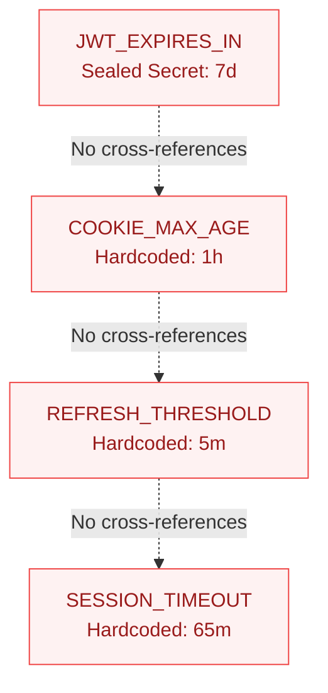
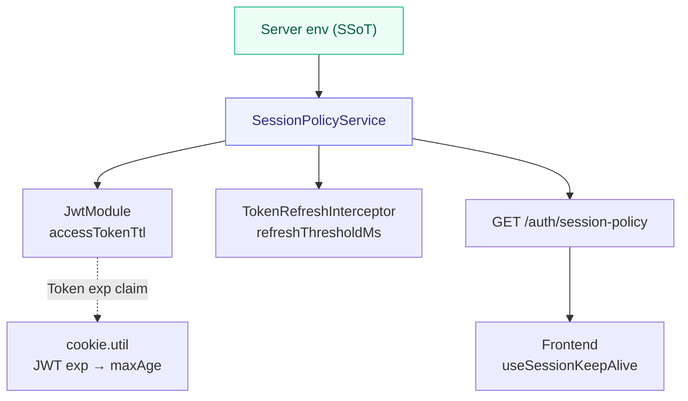

## "The Session Is Too Short"

A user feedback ticket came in:

> "It's annoying to have to log in again every time I switch to something else and come back."

The designed JWT lifetime was **2 hours**, and a **sliding session** that auto-refreshes during user activity was the intended behavior. Two hours should be plenty — so why does it keep dropping?

We started investigating. Long story short, **4 layers were each running on different clocks.** With 12 AI agents each owning a different layer, this kind of distributed state desync was exactly the type of bug that slips through unless someone looks at the whole picture at once.

---

## Four Clocks, Four Truths

Laid out plainly, here's what we found:

| Layer | Value | Note |
|-------|-------|------|
| JWT TTL | 7 days | Production env (designed: 2h) |
| Cookie maxAge | 1 hour | Hardcoded constant |
| Sliding threshold | 5 min | Only refreshes within 5 min of expiry |
| Frontend timer | 65 min | Forced logout judgment |

No matter which one you fixed, another layer would kill the session. Let's tear each one apart.

### Layer 1: A Legacy Value Stuck in the Production Env

```typescript
// Value encrypted in aether-gitops' Sealed Secret
JWT_EXPIRES_IN=7d   // Designed value is 2h — so why?
```

The initial setting of `7d` was still sitting in the Sealed Secret. Token lifetime isn't a secret, yet it was trapped in a secret store, meaning any change required a `kubeseal` + original plaintext `.env` restoration procedure. The barrier to change was unnecessarily high.

### Layer 2: Hardcoded Cookie maxAge

```typescript
// services/gateway/src/auth/cookie.util.ts (before)
const COOKIE_MAX_AGE_SECONDS = 60 * 60; // Fixed at 1 hour
```

No matter how long the JWT TTL was, the browser would discard the cookie **exactly 1 hour later**. JWT and Cookie were in a **structurally separated dual-SSoT** state. "I changed JWT_EXPIRES_IN to 2h, so why does it drop after 1 hour?" — this was the cause.

### Layer 3: Sliding Refresh Was Effectively Disabled

```typescript
// services/gateway/src/auth/token-refresh.interceptor.ts (before)
const REFRESH_THRESHOLD_SECONDS = 5 * 60; // Only refreshes within 5 min of expiry
```

For the first **1 hour and 55 minutes** of a 2-hour TTL, no refresh would happen regardless of incoming requests. If a user paused for 55 minutes and came back, the remaining time was so short they'd be logged out almost immediately. The design intent of "session persists during activity" was effectively non-functional.

### Layer 4: The Frontend Killing the Session Before the Server

```typescript
// frontend/src/hooks/useSessionKeepAlive.ts (before)
const SESSION_TIMEOUT_MS = 65 * 60 * 1000; // 65 minutes
```

The JWT is 2 hours, but the frontend triggers a forced logout at 65 minutes. The server still considers the session valid, but the client cuts it off first.

---

## The Core Bug: Four SSoTs

The problem wasn't individual values — it was **the structure**.

**Before — 4 independent clocks**



Four places were independently managing the same semantic value of "session lifetime." Change one env, and the other three don't follow. **That was the seed of the next bug.**

---

## The Fix: Unifying to a Single Clock

The initial plan was to simply replace each hardcoded value with the correct one. But Oracle (the AI PM agent) sent feedback:

> "Don't hardcode session values — modularize them."

Fair point. Even if we replaced the constant values, the next time policy changed we'd have to hunt down all four places again. We needed a **root cause fix**.

### SessionPolicyModule — A Single Source of Truth

We designed a structure where changing one server environment variable automatically propagates to both server and client.

**After — Server env as the sole SSoT**



The key is that **5 environment variables** determine everything.

| Env Var | Value | Description |
|---------|-------|-------------|
| JWT_EXPIRES_IN | 2h | Access Token TTL |
| SESSION_REFRESH_THRESHOLD | 1h | Sliding refresh threshold |
| SESSION_HEARTBEAT_INTERVAL | 10m | Frontend heartbeat interval |
| SESSION_TIMEOUT_BUFFER | 5m | Expiry grace buffer |
| JWT_DEMO_EXPIRES_IN | 2h | Demo user TTL |

### Data Flow

1. **Server env** — JWT_EXPIRES_IN=2h and 4 others
2. **SessionPolicyService** — env → ms parsing + SSoT
3. **Server consumer injection** — JwtModule · Interceptor · OAuthService
4. **Public API** — GET /auth/session-policy
5. **Frontend fetch** — 1 call at app boot + DEFAULT fallback

---

## Fixes Per Layer

### Layer 1 Fix: Deployment env Override

Instead of re-sealing the Sealed Secret, we leveraged a Kubernetes rule: the Deployment's `env:` block takes **precedence** over `envFrom:` (Sealed Secret).

```yaml
# aether-gitops: algosu/base/gateway.yaml
env:
  - name: JWT_EXPIRES_IN
    value: "2h"
  - name: SESSION_REFRESH_THRESHOLD
    value: "1h"
  - name: SESSION_HEARTBEAT_INTERVAL
    value: "10m"
  - name: SESSION_TIMEOUT_BUFFER
    value: "5m"
```

Token lifetime is not a secret. There's no reason to lock it in a secret store. Plaintext management in manifests is structurally more sound.

### Layer 2 Fix: JWT exp Claim as SSoT

Instead of a constant, Cookie maxAge is now dynamically calculated from the **JWT token's own `exp` claim**.

```typescript
// services/gateway/src/auth/cookie.util.ts (after)
const decoded = jwt.decode(token) as { exp?: number } | null;

if (decoded?.exp) {
  const remainingMs = decoded.exp * 1000 - Date.now();
  if (remainingMs > 0) {
    maxAge = Math.floor(remainingMs / 1000);
  }
}
```

Now when JWT TTL changes, Cookie maxAge **automatically syncs**. Every time a new token is issued via sliding refresh, the Cookie is refreshed too. On decode failure, a defensive 1-hour fallback + structured log is recorded.

### Layer 3 Fix: Sliding Threshold from 5 min → 1 hour

```typescript
// services/gateway/src/auth/token-refresh.interceptor.ts (after)
constructor(
  private readonly sessionPolicy: SessionPolicyService,
  // ...
) {}

// Injected from policy service instead of hardcoded constant
const thresholdMs = this.sessionPolicy.getRefreshThresholdMs();
```

Sliding refresh now kicks in from the **halfway point (1 hour)** of the 2-hour TTL. Active users get effectively infinite sliding sessions. "Refresh on every request" was rejected due to JWT re-signing CPU overhead + Set-Cookie header cost on every response. The 50% threshold is the compromise between performance and UX.

### Layer 4 Fix: Server Policy Fetch

```typescript
// frontend/src/lib/session-policy.ts
export const DEFAULT_SESSION_POLICY: ClientSessionPolicy = {
  accessTokenTtlMs: 60 * 60 * 1000,      // 1h (shorter than server's 2h)
  heartbeatIntervalMs: 10 * 60 * 1000,    // 10m
  sessionTimeoutMs: 65 * 60 * 1000,       // 1h + 5m
  refreshThresholdMs: 30 * 60 * 1000,     // 30m
};

export async function fetchSessionPolicy(): Promise<ClientSessionPolicy> {
  const res = await fetch('/api/auth/session-policy');
  // Falls back to DEFAULT_SESSION_POLICY on failure
}
```

The frontend makes a single `GET /auth/session-policy` call at app boot. Hardcoded values are gone. When server env changes, the frontend automatically receives the new policy on its next boot.

The DEFAULT fallback is **intentionally shorter** than the server default (2h). If the fetch fails, early expiration prevents unexpected 401s — a safety mechanism.

---

## Before / After

| Item | Value | Note |
|------|-------|------|
| JWT TTL | 2h | 7d → 2h |
| Cookie maxAge | Dynamic | Fixed 1h → synced with JWT exp |
| Sliding threshold | 1h | 5 min → 1 hour (50% of TTL) |
| Frontend timer | Policy fetch | Fixed 65 min → synced with server policy |

| Item | Before | After |
|------|--------|-------|
| Number of SSoTs | 4 (each hardcoded) | 1 (server env) |
| On env change | Manual sync across 4 locations | Automatic propagation |
| New external dependencies | — | None (self-contained duration parser) |
| Tests added | — | Gateway 8 + Frontend 16 |

---

## Self-Contained Duration Parser

`SessionPolicyService` includes a built-in parser that converts strings like `2h`, `30m`, or `500ms` into milliseconds. There's a reason we didn't directly depend on the `ms` package.

Currently, `ms` exists as a transitive dependency (brought in by another package). Relying on hoisting means the parser could suddenly disappear when the package manager restructures the tree. A self-contained parser **guarantees fail-fast behavior**. Supported formats are `Nd`, `Nh`, `Nm`, `Ns`, `Nms`, and plain numbers (treated as seconds).

---

## Lesson Checklist

Here's a checklist of lessons from this bug.

> **⚠️ Session Policy Sync Checklist**
>
> **When adding/changing env vars:**
>
> 1. Grep for constants with the same semantic meaning scattered across the codebase
> 2. Check for constants that are "coincidentally the same value" — if they share the same semantics, they must reference the same SSoT
> 3. Verify that changing one env causes **all** related state to follow
> 4. Separate non-secret policy values (TTL, threshold, flags) into ConfigMap/Deployment env instead of Sealed Secrets
>
> **Client-server policy sync:**
>
> 1. Use runtime API fetch instead of `NEXT_PUBLIC_*` build-time injection
> 2. Set DEFAULT fallback shorter than the server default on fetch failure
> 3. Apply positive finite number validation to all policy fields

---

## Closing — Structural Transformation, Not Constant Replacement

The initial plan for this bug was "replace 4 hardcoded numbers with the right numbers." That would have worked in the short term.

But what about the next time session policy changes? You'd have to hunt down all four places again. And someone would miss one. **Replacing constants is a bug fix; transforming the structure is bug prevention.**

After introducing `SessionPolicyModule`, 19 files were changed and 24 tests were added. It wasn't a small effort, but now when you want to change session policy, you just **modify one line of env in the Deployment yaml**. Server, client, and cookies all follow automatically.

Never place a constant with "coincidentally the same meaning" near a policy value controlled by environment variables. If they share the same semantics, they must reference the same source of truth. **If changing one env doesn't cause all related state to follow, that point is the seed of your next bug.**
