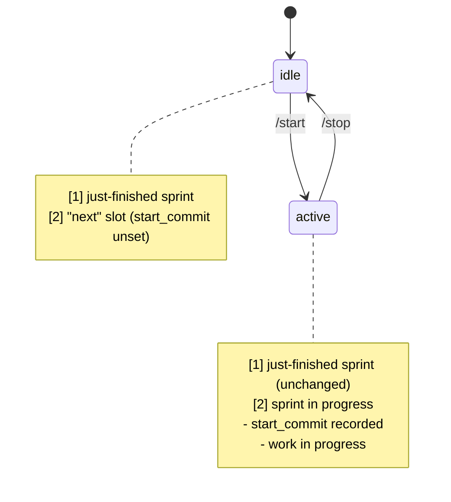
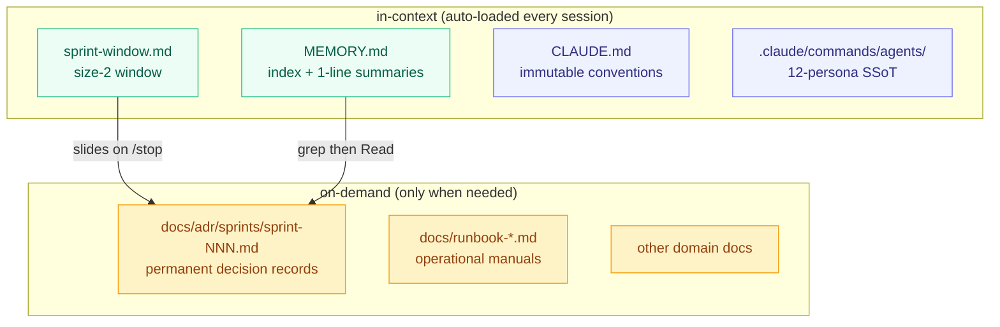

## The 152nd Sprint, and the ADRs Stacked Behind It

Today is Sprint 152. We didn't write a per-sprint ADR from day one — that habit started around Sprint 62, when I began bundling each sprint's decisions and retrospectives into a single file. From then until now, [`docs/adr/sprints/`](https://github.com/tpals0409/AlgoSu/tree/main/docs/adr/sprints) has accumulated nearly 90 files, from `sprint-62.md` through `sprint-151.md`. Next to it sits [`CLAUDE.md`](https://github.com/tpals0409/AlgoSu/blob/main/CLAUDE.md), and inside [`.claude/commands/agents/`](https://github.com/tpals0409/AlgoSu/tree/main/.claude/commands/agents) live 12 agent personas, alongside the `MEMORY.md` that gets refreshed every sprint.

A good thing, those records existing. But also a dangerous one.

> I can't hand all of these to an agent every session.

This post is about admitting that simple fact. And about how, on top of that admission, I layered a sliding window algorithm to put agent context on a diet — small rules that have kept the project running for 152 sprints with zero regressions.

---

## Memory Fades — for Humans, and Even More So for Agents

First, the thing we have to admit: **memory fades.**

It does for humans. Why I added this enum six months ago, why I split that migration across deployments, why this function name is so awkward — given enough time, we forget. Reading the code again won't tell you "why." Code only shows you "what."

Agents have it worse.

Every session, an agent starts with fresh context. Whatever was agreed in the previous conversation, the regression pattern fixed yesterday, the SSoT location decided last week — the next session's agent knows none of it. Same as someone newly arrived. Except a human at least retains a faint memory after a few days off; an agent's recall is precisely zero.

So at AlgoSu, we got serious about documentation early on. Decisions went into ADRs, the context surrounding decisions into per-sprint ADRs, immutable conventions into [`CLAUDE.md`](https://github.com/tpals0409/AlgoSu/blob/main/CLAUDE.md), each agent's role into the [`.claude/commands/agents/`](https://github.com/tpals0409/AlgoSu/tree/main/.claude/commands/agents) persona files — pulling everything-that-must-not-be-forgotten into one place.

---

## Documentation Actually Worked

It really did. Let me point at one small example.

From Sprint 145 to 151 — over seven sprints — **regression-blocking essence accumulated across eight dimensions**. Every regression pattern caught once was hammered into the ADRs so the next sprint wouldn't take the same hit in the same place. Monitoring verification — metric → label → panel-title → variable → rule-label → dashboard-structure → regex-robustness → and finally backend ↔ frontend enum sync. A dimension closed once never reopened.

If you walk through [`docs/adr/sprints/sprint-145.md`](https://github.com/tpals0409/AlgoSu/blob/main/docs/adr/sprints/sprint-145.md) up to [`sprint-151.md`](https://github.com/tpals0409/AlgoSu/blob/main/docs/adr/sprints/sprint-151.md) in order, you can see each sprint's "lessons" section flowing into the next sprint's "new patterns" section. The documents created a tight, living rhythm.

<MetricGrid cols={3}>
  <MetricCard label="Consecutive zero-regression" value="7 sprints" hint="Sprint 145~151" accent={1} />
  <MetricCard label="Accumulated dimensions" value="8" hint="metric → enum sync" accent={2} />
  <MetricCard label="Branch discipline streak" value="17 sprints" hint="since Sprint 134 violation" accent={3} />
</MetricGrid>

That's what documentation gave us. Operating without re-catching a lesson already caught — that's the real cost of maintainability.

---

## And Then — The Documents Themselves Started Becoming the Enemy

That was the happy part. The trouble began afterward.

Once sprints crossed 100 — meaning per-sprint ADRs piled up to nearly 40 — strange things started happening. The volume of documents the agent had to load into context at the start of every session got too large.

At first, this felt like a badge of pride. "Our project records every decision." But at some point the agent began missing the core. Rules clearly written in an ADR got violated. Prohibitions clearly emphasized in CLAUDE.md got broken again.

The same documents, untouched — yet their effect kept thinning over time.

The cause turned out to be simple.

> **I had been pouring water into a full bucket.**

---

## The Full Bucket — The Real Limit of the Context Window

An LLM's context window isn't all about the token limit. Even within the limit, if too much information sits inside, the model's attention scatters. There's a name for this — **lost-in-the-middle**. Core rules trapped in the middle get nibbled away from both ends, and the one line that actually matters drowns in noise.

The more documents grew, the more often this happened.

```
[CLAUDE.md, 200 lines]
[MEMORY.md, 200 lines]
[ADR sprint-62 ~ sprint-151, ~10KB each]
[.claude/commands/agents/, 12 personas]
[docs/runbook-*.md, many]
[other domain documents]
─────────────────────────
Total: half the context budget filled before work even starts
Actual code + conversation space: the other half
Center of attention's gravity: nowhere in particular
```

Tokens may be left over, but the model's "attention" is a finite resource. A hundred emphasized rules are weaker than one emphasized rule. If everything is marked as important, nothing actually is.

But "let's just trim it" was scary too. Any one ADR could hold the decisive line that prevents the next sprint's regression. Naive truncation gives no control over what gets lost.

<Callout type="warn" title="The Documentation Paradox">
Don't write documents and the agent repeats the same mistakes. Hand over all the documents and the agent misses the core. Both are regressions. The only difference is that the second comes with a particular flavor of frustration: "but I told you everything."
</Callout>

---

## The Sliding Window Algorithm — Back to Algorithm Class

The lead came from an algorithms textbook. More precisely, from the very pattern I'd been seeing every week while building an algorithm-study platform.

The **sliding window** algorithm doesn't hold every element when processing arrays or streams. It maintains a window of fixed size, and as a new element enters, the oldest one slides out. Subarray sums, maximum subarray, network packet flow control — it's the standard technique for handling an unbounded stream within bounded space.

```
[1, 2, 3, 4, 5, 6, 7, 8, ...]   ← input stream (unbounded)
   ┌───────┐
   │ 1 2 3 │                      ← window of size 3
   └───────┘
      ┌───────┐
      │ 2 3 4 │                   ← 1 slides out, 4 slides in
      └───────┘
         ┌───────┐
         │ 3 4 5 │                ← 2 slides out, 5 slides in
         └───────┘
```

Sprints worked the same way. We've run 152 of them, and they'll keep accumulating. An unbounded stream, against a bounded space — the context window. So — **hold only as much as the window, and pull the rest from a permanent store on demand.**

That was the start.

---

## sprint-window.md — Window Size 2

The heart of it is a file called `memory/sprint-window.md`. (This file lives in the user's local memory. It isn't a team-shared SSoT — it's the "current working context" file that an agent reads first, every session. That's why I cite it by path rather than a GitHub link.)

The window size is **2**.

```markdown
---
name: sprint window
description: sliding window keeping only the last 2 sprints
status: active
---

## [1] Done — Sprint 151: Programmers SQL auto language select
- period, end_commit, merged PRs, work summary, Critic call results,
  validation, regression-blocking layers, new patterns, lessons, carry-over

## [2] In progress — Sprint 152: sliding window blog post
- start_commit, goal, planned tasks, owning agents
```

**[1] is the just-finished sprint, [2] is the one in progress.** That's it. Anything older lives outside the window.

I tried sizes 3 and 4 at first. More memory must be better, right? The result was the opposite. As the window grew, the context for the in-progress work in [2] got blurrier. Things got tangled with decisions too far away, or old patterns clashing with the most recent one kept getting dragged in.

Size 2 was the sweet spot. The just-prior sprint's lessons stayed sharp, while older ones became something to open explicitly only when needed.

### `status: idle | active` — A State Machine for Auto-Sliding

How does the window slide? Automatically.

The `status` field in the frontmatter acts as a state machine.



`/start` fills [2] with new sprint metadata and flips `status` to `active`. `/stop` triggers something bigger.

1. The work output of [2] (merged PRs, validation, lessons) slides into [1] — the old [1] gets pushed out
2. The pushed-out [1] becomes a permanent record in [`docs/adr/sprints/sprint-{N}.md`](https://github.com/tpals0409/AlgoSu/tree/main/docs/adr/sprints)
3. [2] resets to an empty "next" slot
4. `status` flips back to `idle`

The agent operates only inside the window; everything outside is the permanent store's responsibility. Once a decision slides into an ADR, it doesn't disappear. It just leaves the auto-loaded in-context set — still callable through a precise path the moment it's needed.

---

## A 4-Layer Storage Structure — Separating "Where to Forget" from "Where to Remember"

The sliding window alone wasn't enough. The window defines "what we hold right now," but everything outside the window has to live somewhere too. So I split storage into 4 layers.



Each layer has a distinct role.

| Layer | File | Volatility | Auto-loaded? | What it preserves |
|-------|------|------------|--------------|-------------------|
| Window | `sprint-window.md` | every sprint | ✅ | last-done + in-progress (size 2) |
| Index | `MEMORY.md` | every sprint | ✅ | 1-line summary + link to permanent store |
| Conventions | [`CLAUDE.md`](https://github.com/tpals0409/AlgoSu/blob/main/CLAUDE.md) | rarely changes | ✅ | conventions, prohibitions, security rules |
| Personas | [`.claude/commands/agents/`](https://github.com/tpals0409/AlgoSu/tree/main/.claude/commands/agents) | rarely changes | ✅ | 12 agents' roles and prohibitions |
| Permanent store | [`docs/adr/sprints/`](https://github.com/tpals0409/AlgoSu/tree/main/docs/adr/sprints) | append-only | ❌ | every sprint's decisions and lessons (forever) |

The core idea is **separating "where to forget" from "where to remember."**

The agent's in-context is the place to forget. As the window slides, old things naturally fall out — that's how each session's attention gathers around new work. The permanent store is the place to remember. Once a decision lands there, it doesn't disappear. It just doesn't get auto-pulled — but the precise path is always there.

### MEMORY.md — The Role of an Index

`MEMORY.md` is kept under 200 lines. It's not the body. **It's an index.**

```markdown
- Sprint 151 — Programmers SQL auto language select (2026-05-13):
  Backend Problem entity ProblemCategory enum + ... (1-line summary)
  ADR: [sprint-151.md](../../../../Desktop/leo.kim/AlgoSu/docs/adr/sprints/sprint-151.md)
- Sprint 150 — Carry-over seed cleanup (2026-05-13):
  Sprint 149 automation candidates, 3 PRs in a single day ...
  ADR: [sprint-150.md](...)
```

Each line is just a marker that says "this happened." The body is in the ADR. When an agent wants to revisit a decision precisely, it follows the path from the index into the permanent store.

This way, the per-session in-context cost is roughly index-line × number-of-sprints, not body × ~10KB each. The difference is large.

### CLAUDE.md and Personas — The Immutable SSoT

These two files barely change. Conventions, prohibitions, security rules, agent roles — these can't shift sprint to sprint.

In return, what doesn't change costs little to keep in-context permanently. The model treats it as "the thing that's always there" and doesn't have to relearn it every time. A strong rule that doesn't change > a weak rule that changes often. The choice of what to nail down hard mattered.

The [`.claude/commands/agents/`](https://github.com/tpals0409/AlgoSu/tree/main/.claude/commands/agents) directory in particular **switched to tracked** in Sprint 150. Before that it was local-only and gitignored. Out-of-sync drift across machines piled up as debt, and we eventually pulled it up into a team-shared SSoT — so all 12 personas live in one source of truth.

---

## The Result — Seven Sprints in a Row Without Regression

After introducing the sliding window, the most visible change in numbers was the regression rate.

<MetricGrid cols={3}>
  <MetricCard label="Regression-blocking essence" value="8 dimensions" hint="Sprint 145~151 cumulative" accent={1} />
  <MetricCard label="Consecutive zero-regression" value="7 sprints" hint="evidence the docs are working" accent={2} />
  <MetricCard label="Branch discipline violations" value="0" hint="17 sprints since Sprint 134" accent={3} />
</MetricGrid>

Of course, none of this is the sliding window's doing alone. Auto-Critic auto-queueing introduced in Sprint 117, the Critic seat (Codex cross-review) added in Sprint 114, the orchestration of 12 agents — many devices act together.

But the sliding window is what let those devices act *consistently*. The just-prior sprint's lessons don't blur, while older decisions don't drag the present back — that balance was the foundation of regression blocking.

### Auto-Critic Belongs to the Same Family as the Sliding Window

Since Sprint 117, every code-changing commit auto-queues Codex (gpt-5) for cross-review. Round 1, Round 2, sometimes Round 3 before the PR merges — when Critic surfaces P0/P1/P2 issues, the fix gets re-delegated to the owning domain agent.

What matters here is that **none of this cross-review burdens the main context**. Codex runs in a separate process and only the summary returns. The session's context window stays whole.

Same philosophy as the sliding window. **"Only when needed, only as much as needed, keep the main context light."**

In Sprint 151 alone, Auto-Critic was called four times and the main context still felt no different from usual. All four found 0 P0/P1, only 1 P2 → resolved in R2 → all closed clean. ([`sprint-151.md`](https://github.com/tpals0409/AlgoSu/blob/main/docs/adr/sprints/sprint-151.md) records the full trace.)

---

## Learning to Forget Was How You Remember

At first I thought, "If only I could remember everything." Push every ADR, every entry in MEMORY, every decision and every lesson into context, and the agent would work smarter for it.

The opposite happened. The more I pushed in, the blurrier the agent got. If everything is important, nothing is. Just as a full bucket spills no matter how much more you pour, a saturated context only thins its attention as you stack more on top.

What the sliding window taught me was that **"what to forget" comes before "what to remember"**. Define the place to forget, and the place to remember sharpens. The window forgets what's outside it — but the permanent store keeps it on a precise path, ready to be retrieved the moment it's needed.

Documents can pile up indefinitely. The per-sprint ADRs will go from nearly 90 to 100, and on toward 200. But the window stays at 2. The weight an agent carries every session doesn't grow. What grows is the depth of the permanent store and the sharpness of the index.

Memory fades. That's why we need documents. But too many documents fade again. That's why we needed the sliding window. **Learning to forget, in the end, was how you remember.**

The next sprint, and the one after — the window will keep turning at the same size. What's inside will change every time. That, I think, is the breathing rhythm of maintenance. You have to exhale as much as you inhale before the next breath comes in.
