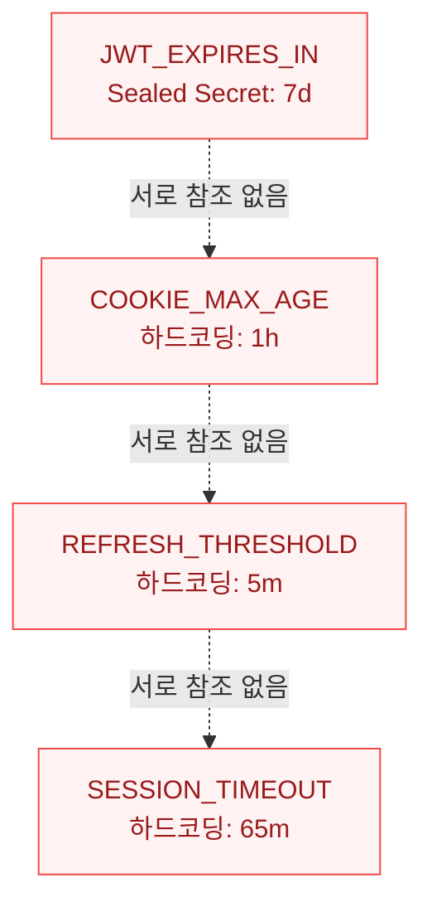
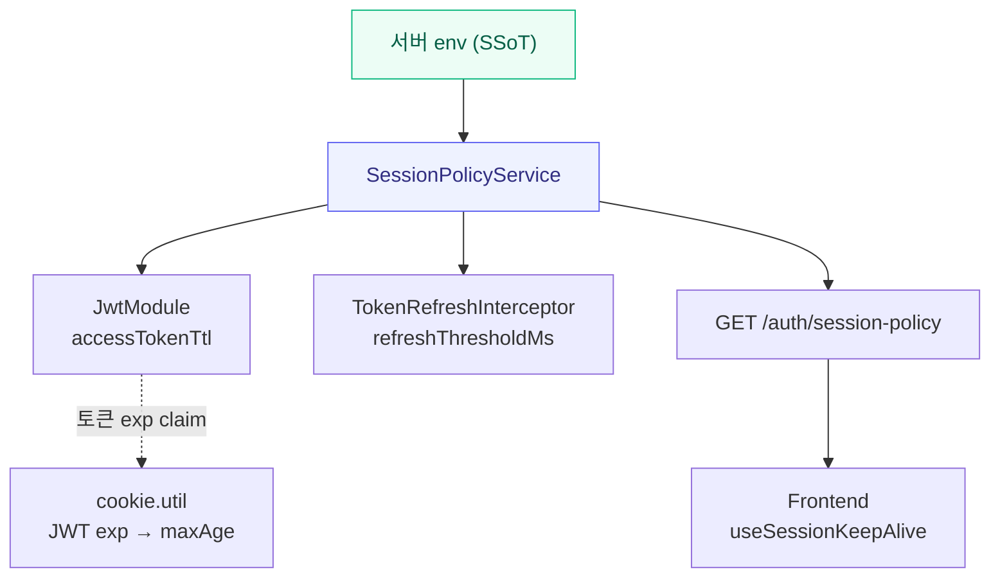

## "세션이 너무 짧아요"

사용자 피드백이 하나 들어왔습니다.

> "다른 거 하다가 돌아오면 또 로그인해야 하는 게 귀찮아요."

기획된 JWT 수명은 **2시간**이고, 사용자 활동 중에는 토큰이 자동 갱신되는 **sliding session**이 의도된 동작이었습니다. 2시간이면 충분한데, 왜 자꾸 끊길까요?

진단을 시작했습니다. 결론부터 말하면, **4개 레이어가 각자 다른 시계를 쓰고 있었습니다.** AI 에이전트 12명이 각 레이어를 나눠 작업하는 구조다 보니, 이런 분산 상태 불일치는 전체를 한눈에 보지 않으면 잡기 어려운 버그였습니다.

---

## 4개의 시계, 4개의 진실

문제를 정리하면 이렇습니다.

| 레이어 | 값 | 비고 |
|--------|-----|------|
| JWT TTL | 7일 | 운영 env (기획: 2h) |
| Cookie maxAge | 1시간 | 하드코딩 상수 |
| Sliding 임계값 | 5분 | 만료 5분 전에만 갱신 |
| 프론트 타이머 | 65분 | 강제 로그아웃 판정 |

어느 한 곳을 고쳐도 다른 레이어가 세션을 끊는 구조였습니다. 하나씩 뜯어보겠습니다.

### Layer 1: 운영 env에 박혀 있던 레거시 값

```typescript
// aether-gitops의 Sealed Secret에 암호화 저장된 값
JWT_EXPIRES_IN=7d   // 기획값은 2h인데?
```

Sealed Secret에 초기 설정값 `7d`가 그대로 남아 있었습니다. 토큰 수명은 비밀이 아닌데, 비밀 저장소에 갇혀 있어서 수정하려면 `kubeseal` + 원본 평문 `.env` 복원 절차가 필요했습니다. 변경 허들이 불필요하게 높았어요.

### Layer 2: Cookie maxAge 하드코딩

```typescript
// services/gateway/src/auth/cookie.util.ts (수정 전)
const COOKIE_MAX_AGE_SECONDS = 60 * 60; // 1시간 고정
```

JWT TTL이 아무리 길어도 브라우저가 **정확히 1시간 뒤** 쿠키를 폐기합니다. JWT와 Cookie가 **구조적으로 분리된 이중 SSoT** 상태였어요. "JWT_EXPIRES_IN을 2h로 바꿨는데 왜 1시간 만에 끊기지?"의 원인이 바로 이겁니다.

### Layer 3: Sliding Refresh가 사실상 꺼져 있었음

```typescript
// services/gateway/src/auth/token-refresh.interceptor.ts (수정 전)
const REFRESH_THRESHOLD_SECONDS = 5 * 60; // 만료 5분 전에만 갱신
```

2시간 TTL 중 **앞 1시간 55분** 동안은 요청이 와도 갱신이 일어나지 않았습니다. 사용자가 55분 쉬었다 돌아오면 잔여 시간이 적어서 곧바로 로그아웃. "활동 중에는 세션이 유지된다"는 기획 의도가 사실상 작동하지 않는 상태였어요.

### Layer 4: 프론트엔드가 서버보다 먼저 세션을 끊음

```typescript
// frontend/src/hooks/useSessionKeepAlive.ts (수정 전)
const SESSION_TIMEOUT_MS = 65 * 60 * 1000; // 65분
```

JWT는 2시간인데 프론트엔드가 65분에 강제 로그아웃 판정을 내립니다. 서버는 아직 유효한 세션인데 클라이언트가 먼저 끊어버리는 거죠.

---

## 버그의 핵심: SSoT가 4개

문제는 개별 값이 아니라 **구조**였습니다.

**수정 전 — 4개의 독립적인 시계**



4곳이 각자 "세션 수명"이라는 같은 의미의 값을 독립적으로 관리하고 있었습니다. env 하나를 바꿔도 나머지 3곳이 따라오지 않는 구조. **이게 다음 버그의 씨앗**이었어요.

---

## 해결: 하나의 시계로 통일

처음에는 각 하드코딩 값을 올바른 값으로 교체하는 초기안을 세웠습니다. 하지만 Oracle(AI PM 에이전트)의 피드백이 왔습니다.

> "세션을 하드코딩하지 말고 모듈화해."

맞는 말이었습니다. 상수 값을 교체해봐야, 다음에 정책이 바뀌면 또 4곳을 찾아다녀야 합니다. **근본 치료**가 필요했어요.

### SessionPolicyModule — 단일 진실의 원천

서버 환경변수 하나를 바꾸면 서버와 클라이언트 모두 자동으로 따라오는 구조를 설계했습니다.

**수정 후 — 서버 env가 유일한 SSoT**



핵심은 **5개 환경변수**가 모든 것을 결정한다는 점입니다.

| 환경변수 | 값 | 설명 |
|---------|-----|------|
| JWT_EXPIRES_IN | 2h | Access Token TTL |
| SESSION_REFRESH_THRESHOLD | 1h | Sliding 갱신 임계값 |
| SESSION_HEARTBEAT_INTERVAL | 10m | 프론트 heartbeat 주기 |
| SESSION_TIMEOUT_BUFFER | 5m | 만료 여유 버퍼 |
| JWT_DEMO_EXPIRES_IN | 2h | 데모 유저 전용 TTL |

### 데이터 흐름

1. **서버 env** — JWT_EXPIRES_IN=2h 등 5종
2. **SessionPolicyService** — env → ms 단위 파싱 + SSoT
3. **서버 소비자 주입** — JwtModule · Interceptor · OAuthService
4. **공개 API** — GET /auth/session-policy
5. **프론트 fetch** — 앱 부트 시 1회 + DEFAULT fallback

---

## 각 레이어별 수정

### Layer 1 해결: Deployment env override

Sealed Secret을 재봉인하는 대신, Kubernetes의 규칙을 활용했습니다. Deployment의 `env:` 블록은 `envFrom:` (Sealed Secret)보다 **우선**합니다.

```yaml
# aether-gitops: algosu/base/gateway.yaml
env:
  - name: JWT_EXPIRES_IN
    value: "2h"
  - name: SESSION_REFRESH_THRESHOLD
    value: "1h"
  - name: SESSION_HEARTBEAT_INTERVAL
    value: "10m"
  - name: SESSION_TIMEOUT_BUFFER
    value: "5m"
```

토큰 수명은 비밀이 아닙니다. 비밀 저장소에 가둘 이유가 없어요. 매니페스트 평문 관리가 구조적으로 합리적입니다.

### Layer 2 해결: JWT exp claim SSoT

Cookie maxAge를 상수 대신 **JWT 토큰 자체의 `exp` claim**에서 동적으로 계산합니다.

```typescript
// services/gateway/src/auth/cookie.util.ts (수정 후)
const decoded = jwt.decode(token) as { exp?: number } | null;

if (decoded?.exp) {
  const remainingMs = decoded.exp * 1000 - Date.now();
  if (remainingMs > 0) {
    maxAge = Math.floor(remainingMs / 1000);
  }
}
```

이제 JWT TTL이 바뀌면 Cookie maxAge가 **자동으로 동기화**됩니다. Sliding refresh로 새 토큰이 발급될 때마다 Cookie도 함께 갱신되고요. 디코딩 실패 시에는 방어적 fallback 1시간 + structured log를 기록합니다.

### Layer 3 해결: Sliding 임계값 5분 → 1시간

```typescript
// services/gateway/src/auth/token-refresh.interceptor.ts (수정 후)
constructor(
  private readonly sessionPolicy: SessionPolicyService,
  // ...
) {}

// 하드코딩 상수 대신 정책 서비스에서 주입
const thresholdMs = this.sessionPolicy.getRefreshThresholdMs();
```

2시간 TTL의 **절반 지점(1시간)**부터 요청마다 sliding 갱신이 일어납니다. 활성 사용자는 사실상 무한 sliding. "매 요청마다 갱신"은 JWT 재서명 CPU 오버헤드 + 매 응답 Set-Cookie 헤더 비용 때문에 기각했습니다. 50% 임계값이 성능과 UX의 타협점입니다.

### Layer 4 해결: 서버 정책 fetch

```typescript
// frontend/src/lib/session-policy.ts
export const DEFAULT_SESSION_POLICY: ClientSessionPolicy = {
  accessTokenTtlMs: 60 * 60 * 1000,      // 1h (서버 2h보다 짧게)
  heartbeatIntervalMs: 10 * 60 * 1000,    // 10m
  sessionTimeoutMs: 65 * 60 * 1000,       // 1h + 5m
  refreshThresholdMs: 30 * 60 * 1000,     // 30m
};

export async function fetchSessionPolicy(): Promise<ClientSessionPolicy> {
  const res = await fetch('/api/auth/session-policy');
  // 실패 시 DEFAULT_SESSION_POLICY fallback
}
```

프론트엔드는 앱 부트 시 `GET /auth/session-policy`를 1회 호출합니다. 하드코딩이 사라졌습니다. 서버 env가 바뀌면 프론트엔드는 다음 부팅 때 자동으로 새 정책을 받아옵니다.

DEFAULT fallback은 서버 기본값(2h)보다 **일부러 짧게** 설정했습니다. fetch가 실패하면 조기 만료로 돌발 401을 방지하는 안전장치입니다.

---

## Before / After

| 항목 | 값 | 비고 |
|------|----|------|
| JWT TTL | 2h | 7d → 2h |
| Cookie maxAge | 동적 | 1h 고정 → JWT exp 연동 |
| Sliding 임계값 | 1h | 5분 → 1시간 (TTL 50%) |
| 프론트 타이머 | 정책 fetch | 65분 고정 → 서버 정책 연동 |

| 항목 | 수정 전 | 수정 후 |
|------|---------|---------|
| SSoT 개수 | 4개 (각자 하드코딩) | 1개 (서버 env) |
| env 변경 시 | 4곳 수동 동기화 필요 | 자동 전파 |
| 신규 외부 의존 | — | 없음 (자체 duration 파서) |
| 테스트 추가 | — | Gateway 8건 + Frontend 16건 |

---

## 자체 Duration 파서

`SessionPolicyService`에는 `2h`, `30m`, `500ms` 같은 문자열을 밀리초로 변환하는 파서가 내장되어 있습니다. `ms` 패키지를 직접 의존하지 않은 이유가 있습니다.

현재 `ms`는 transitive dependency 상태(다른 패키지가 가져온 것)입니다. hoisting에 의존하면 패키지 매니저가 트리를 재구성할 때 파서가 갑자기 사라질 수 있어요. 자체 파서를 내장하면 **fail-fast가 보장**됩니다. 지원 포맷은 `Nd`, `Nh`, `Nm`, `Ns`, `Nms`와 순수 숫자(초 단위)입니다.

---

## 교훈 체크리스트

이 버그에서 얻은 교훈을 체크리스트로 정리했습니다.

> **⚠️ 세션 정책 동기화 체크리스트**
>
> **env 추가/변경 시:**
>
> 1. 같은 의미의 상수가 코드에 흩어져 있지 않은지 grep
> 2. "우연히 같은 값"인 상수는 없는지 확인 — 같은 시맨틱이면 반드시 동일 SSoT 참조
> 3. env 하나를 바꿨을 때 연관 상태가 **모두** 따라오는지 검증
> 4. 비-비밀 정책 값(TTL, threshold, flag)은 Sealed Secret이 아닌 ConfigMap/Deployment env로 분리
>
> **클라이언트-서버 정책 동기화:**
>
> 1. `NEXT_PUBLIC_*` 빌드타임 주입 대신 런타임 API fetch 방식 사용
> 2. fetch 실패 시 DEFAULT fallback은 서버 기본값보다 짧게 설정
> 3. 모든 정책 필드에 positive finite number 검증 적용

---

## 마무리 — 상수 교체가 아닌 구조 전환

이 버그의 초기안은 "하드코딩된 숫자 4개를 올바른 숫자로 바꾸자"였습니다. 그걸로도 당장은 고쳐졌을 겁니다.

하지만 다음에 세션 정책이 바뀌면? 또 4곳을 찾아다녀야 합니다. 그리고 누군가는 한 곳을 빼먹을 겁니다. **상수 교체는 버그 수정이고, 구조 전환은 버그 예방입니다.**

`SessionPolicyModule` 도입 후 변경된 파일은 19개, 추가된 테스트는 24건이었습니다. 적지 않은 작업이었지만, 이제 세션 정책을 바꾸고 싶으면 **Deployment yaml의 env 한 줄**만 수정하면 됩니다. 서버도, 클라이언트도, Cookie도 자동으로 따라옵니다.

환경변수로 제어하는 정책 값 근처에 "우연히 같은 의미"를 가진 상수를 두지 마세요. 같은 시맨틱이면 반드시 동일 진실의 원천을 참조해야 합니다. **env 하나를 바꿨을 때 연관 상태가 모두 따라오지 않으면, 그 지점이 다음 버그의 씨앗입니다.**
