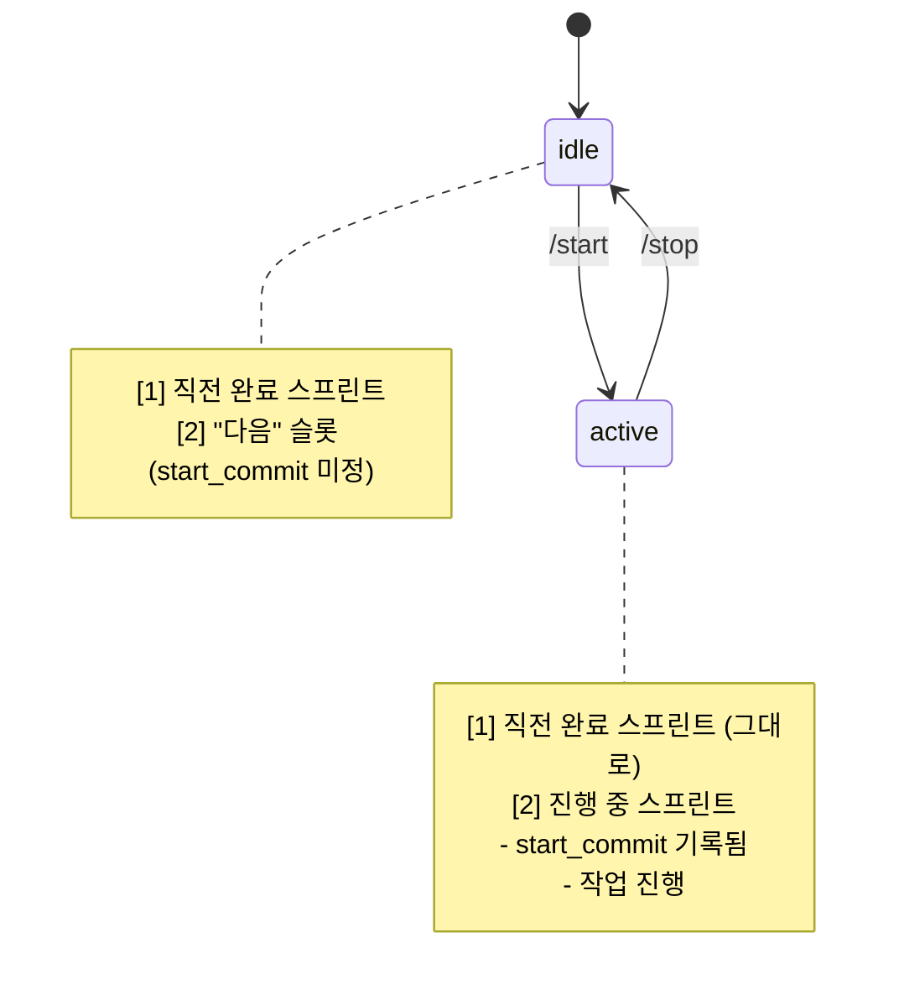
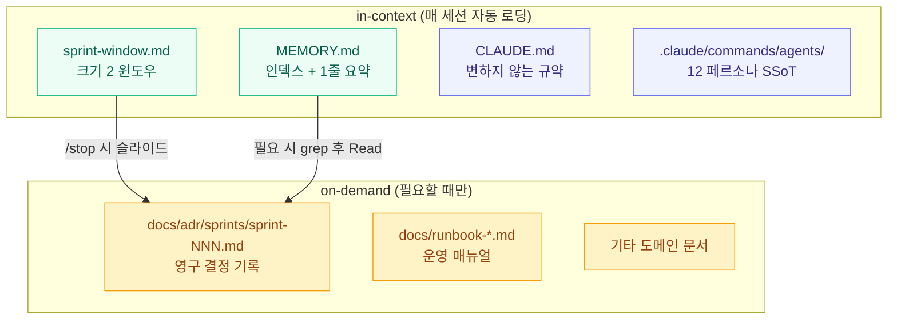

## 152번째 스프린트, 그리고 152개의 ADR

오늘은 Sprint 152입니다. 어제까지의 결정과 회고가 [`docs/adr/sprints/`](https://github.com/tpals0409/AlgoSu/tree/main/docs/adr/sprints) 아래에 `sprint-001.md`부터 `sprint-151.md`까지 차곡차곡 쌓여 있어요. 그 옆에는 [`CLAUDE.md`](https://github.com/tpals0409/AlgoSu/blob/main/CLAUDE.md)가 있고, [`.claude/commands/agents/`](https://github.com/tpals0409/AlgoSu/tree/main/.claude/commands/agents)에는 12개의 에이전트 페르소나가, 그리고 매 스프린트마다 갱신되는 `MEMORY.md`가 있습니다.

좋은 일이에요. 기록이 남아 있다는 건. 그런데 동시에 위험한 일이기도 합니다.

> 이 모든 문서를 매 세션마다 agent에게 들이밀 수는 없거든요.

이번 글은 그 단순한 사실을 인정하기까지의 기록입니다. 그리고 그 인정 위에 어떻게 슬라이딩 윈도우 알고리즘을 얹어 컨텍스트를 다이어트했는지, 152 스프린트 동안 회귀 0건으로 굴러가게 만든 작은 규칙들에 대한 이야기예요.

---

## 기억의 휘발성 — 사람도, agent도, 잊는다

먼저 인정해야 할 게 있어요. **기억은 휘발됩니다.**

사람이 그래요. 6개월 전에 내가 왜 이 enum을 추가했는지, 왜 이 마이그레이션을 분리해서 배포했는지, 왜 이 함수 이름이 이렇게 어색한지 — 시간이 지나면 잊습니다. 코드를 다시 읽어도 "왜"는 나오지 않아요. 코드는 "무엇을" 보여줄 뿐이거든요.

그런데 agent는 더 심합니다.

매 세션 agent는 새 컨텍스트로 시작합니다. 이전 대화에서 합의했던 것, 어제 fix한 회귀 패턴, 지난주에 결정한 SSoT 위치 — 다음 세션의 agent는 모릅니다. 새로 시작한 사람과 같은 상태예요. 다만 사람은 며칠 안 보면 어렴풋이라도 기억하지만, agent는 정확히 0이에요.

그래서 AlgoSu에서는 일찍부터 문서화에 진심이었습니다. 결정은 ADR로, 결정을 둘러싼 컨텍스트는 sprint별 ADR로, 변하지 않는 규약은 [`CLAUDE.md`](https://github.com/tpals0409/AlgoSu/blob/main/CLAUDE.md)로, 각 에이전트의 역할은 [`.claude/commands/agents/`](https://github.com/tpals0409/AlgoSu/tree/main/.claude/commands/agents) 페르소나 파일로 — 잊혀선 안 될 것들을 한 군데로 모으기 시작했어요.

---

## 문서화는 진짜로 효과가 있었습니다

실제로 효과가 있었어요. 작은 사례 하나만 짚어볼게요.

Sprint 145부터 151까지, 7번의 스프린트 동안 **회귀 차단 본질이 8차원으로 누적**됐습니다. 매 스프린트마다 한 번 잡힌 회귀 패턴은 다음 스프린트가 같은 자리에서 다시 다치지 않도록 ADR에 박혀 들어갔어요. monitoring 검증 — metric → label → panel-title → variable → rule-label → dashboard-structure → regex-robustness → 그리고 backend ↔ frontend enum 동기화까지. 한 번 닫힌 차원은 다음 스프린트에서 다시 열리지 않았습니다.

[`docs/adr/sprints/sprint-145.md`](https://github.com/tpals0409/AlgoSu/blob/main/docs/adr/sprints/sprint-145.md)부터 [`sprint-151.md`](https://github.com/tpals0409/AlgoSu/blob/main/docs/adr/sprints/sprint-151.md)까지 차례로 열어 보면, 각 스프린트의 "교훈" 섹션이 다음 스프린트의 "신규 패턴" 섹션으로 이어지는 흐름이 보여요. 문서가 살아 있는 단단한 리듬을 만들어냈습니다.

<MetricGrid cols={3}>
  <MetricCard label="연속 회귀 0건" value="7 스프린트" hint="Sprint 145~151" accent={1} />
  <MetricCard label="누적 차원" value="8" hint="metric → enum 동기화" accent={2} />
  <MetricCard label="브랜치 규율 준수" value="17 스프린트" hint="Sprint 134 위반 이후" accent={3} />
</MetricGrid>

문서화가 가져다준 결과입니다. 한 번 잡은 교훈을 다시 잡지 않아도 되는 운영, 그게 유지보수의 진짜 비용이에요.

---

## 그런데 — 문서 자체가 적이 되기 시작했어요

여기까지는 행복한 이야기예요. 문제는 그 다음에 일어났습니다.

스프린트가 100을 넘어가면서, 그러니까 ADR이 100개를 넘어가던 시점부터 이상한 일들이 생기기 시작했어요. agent가 매 세션 시작할 때 컨텍스트로 들이미는 문서의 양이 너무 커졌습니다.

처음에는 자랑스러운 일이었어요. "우리 프로젝트는 결정이 다 기록돼 있어." 그런데 어느 순간부터 agent가 핵심을 놓치기 시작했습니다. 분명히 ADR에 적힌 규칙인데 위반하고, 분명히 CLAUDE.md에 강조된 금지사항인데 또 어기고요.

같은 문서를 그대로 두는데도, 시간이 갈수록 효과가 떨어졌어요.

원인은 결국 단순했습니다.

> **꽉 찬 물통에 물을 계속 붓고 있었던 거예요.**

---

## 꽉 찬 물통 비유 — 컨텍스트 윈도우의 진짜 한계

LLM의 컨텍스트 윈도우는 토큰 한도가 전부가 아닙니다. 한도 안에 들어 있더라도, 그 안에 너무 많은 정보가 있으면 모델의 attention이 분산돼요. **lost-in-the-middle** 현상이라고도 불리죠. 가운데 끼인 핵심 규칙은 양쪽 끝에서 갉아먹히고, 정작 봐야 할 한 줄은 노이즈에 묻혀 버립니다.

문서가 많아질수록 이런 일이 자주 일어났어요.

```
[CLAUDE.md 200줄]
[MEMORY.md 200줄]
[ADR sprint-001 ~ sprint-152, 각 ~10KB]
[.claude/commands/agents/ 12개 페르소나]
[docs/runbook-*.md 다수]
[기타 도메인 문서들]
─────────────────────────
총량: 컨텍스트 한도의 절반이 시작부터 채워짐
실제 작업할 코드 + 대화 공간: 절반
attention의 무게중심: 어디에도 못 모임
```

토큰은 남아 있어도, 모델의 "주의력"이라는 자원은 한계가 있어요. 100개의 강조된 규칙은, 1개의 강조된 규칙보다 약합니다. 모두가 중요하다고 표시되면, 결국 어느 것도 중요하지 않은 거예요.

그런데 단순히 "줄이자"고 하기엔 또 무서웠습니다. 어느 ADR 하나는 다음 스프린트의 회귀를 막아 줄 결정적인 한 줄을 갖고 있을 수 있거든요. 단순 truncate는 무엇을 잃을지 통제가 안 됩니다.

<Callout type="warn" title="문서화의 역설">
문서를 안 쓰면 agent는 같은 실수를 반복합니다. 문서를 다 들이밀면 agent는 핵심을 놓칩니다. 둘 다 회귀입니다. 다만 두 번째는 "내가 다 알려줬는데?"라는 억울함이 따라온다는 차이가 있을 뿐이에요.
</Callout>

---

## 슬라이딩 윈도우 알고리즘 — 알고리즘 시간으로 돌아가다

해결의 실마리는 알고리즘 책에서 왔습니다. 정확히는, 알고리즘 스터디 플랫폼을 만들면서 매주 보던 그 패턴이요.

**슬라이딩 윈도우(sliding window)** 알고리즘은 배열이나 스트림을 처리할 때 모든 원소를 한꺼번에 들고 있지 않습니다. 일정 크기의 "윈도우"만 유지하고, 새 원소가 들어오면 가장 오래된 원소를 윈도우 밖으로 밀어내요. 부분합, 최대 부분 수열, 네트워크 패킷 흐름 제어까지 — 한정된 공간에서 무한한 스트림을 다루는 표준 기법입니다.

```
[1, 2, 3, 4, 5, 6, 7, 8, ...]   ← 입력 스트림 (무한)
   ┌───────┐
   │ 1 2 3 │                      ← 윈도우 크기 3
   └───────┘
      ┌───────┐
      │ 2 3 4 │                   ← 1이 빠지고 4가 들어옴
      └───────┘
         ┌───────┐
         │ 3 4 5 │                ← 2가 빠지고 5가 들어옴
         └───────┘
```

스프린트도 그랬습니다. 152번 진행됐고, 앞으로도 계속 늘어날 거예요. 무한한 스트림이고, 컨텍스트 한도라는 유한한 공간에 다 담을 수 없습니다. 그렇다면 — **윈도우만큼만 들고, 나머지는 영구 저장소에서 on-demand로 꺼내자.**

이게 도입의 시작이었어요.

---

## sprint-window.md — 윈도우 크기 2

가장 핵심은 `memory/sprint-window.md`라는 파일입니다. (이 파일은 사용자 로컬 메모리에 있어요. 팀 공유 SSoT가 아니라, 매 세션 agent가 가장 먼저 읽어 들이는 "현재 작업 문맥" 파일이거든요. 그래서 GitHub 링크가 아닌 경로로만 적었습니다.)

윈도우 크기는 **2**입니다.

```markdown
---
name: 스프린트 윈도우
description: 최근 2 스프린트만 유지하는 슬라이딩 윈도우
status: active
---

## [1] 완료 — Sprint 151: 프로그래머스 SQL 자동 언어 선택
- 기간, end_commit, 머지된 PR, 작업 요약, Critic 호출 결과,
  검증, 회귀 차단 레이어, 신규 패턴, 교훈, 다음 스프린트 이월

## [2] 진행 — Sprint 152: 슬라이딩 윈도우 블로그 글 작성
- start_commit, 목표, 계획 작업, 담당 에이전트
```

**[1]은 직전에 끝난 스프린트, [2]는 지금 진행 중인 스프린트.** 그게 다입니다. 그 이전은 윈도우 밖이에요.

처음에는 크기 3, 4도 시도해봤습니다. 더 많이 기억하면 좋지 않을까 싶어서요. 결과는 반대였습니다. 윈도우가 커질수록 [2]에 진행 중인 작업의 컨텍스트가 흐려졌어요. 너무 멀리 있는 결정에 발이 묶이거나, 직전 결정과 충돌하는 옛 패턴이 끌려 나오거나 했습니다.

크기 2가 sweet spot이었어요. 직전 스프린트의 교훈은 진하게 살리고, 그 이전은 필요할 때만 ADR을 명시적으로 열어보는 구조.

### `status: idle | active` — 상태머신으로 슬라이드 자동화

윈도우의 슬라이드는 어떻게 일어날까요? 자동입니다.

frontmatter의 `status` 필드가 상태머신 역할을 해요.



`/start` 시점에 [2]에 새 스프린트 메타가 채워지고 `status: active`로 전환됩니다. `/stop` 시점에는 더 큰 일이 일어나요.

1. [2]의 작업 결과(머지된 PR, 검증, 교훈)가 [1]로 슬라이드 — 옛 [1]은 밀려납니다
2. 밀려난 옛 [1]은 [`docs/adr/sprints/sprint-{N}.md`](https://github.com/tpals0409/AlgoSu/tree/main/docs/adr/sprints)로 영구 저장
3. [2]는 비어 있는 "다음" 슬롯으로 초기화
4. `status: idle`로 전환

agent는 윈도우 안에서만 작업하고, 윈도우 밖은 영구 저장소가 책임집니다. 한 번 슬라이드되어 ADR에 들어간 결정은 사라지지 않아요. 다만 in-context 자동 로딩에서 빠질 뿐, 필요한 순간 정확한 경로로 호출됩니다.

---

## 4계층 저장 구조 — "잊는 곳"과 "기억하는 곳"의 분리

슬라이딩 윈도우 하나만으로는 부족했어요. 윈도우는 "지금 무엇을 들고 있을까"를 정의하지만, 윈도우 밖에 있는 것들도 어딘가에 살아 있어야 했거든요. 그래서 저장 구조를 4계층으로 분리했습니다.



각 계층의 역할이 다릅니다.

| 계층 | 파일 | 변동성 | 자동 로딩? | 무엇을 보존하나 |
|------|------|--------|-----------|----------------|
| 윈도우 | `sprint-window.md` | 매 스프린트 | ✅ | 직전 완료 + 진행 중 (크기 2) |
| 인덱스 | `MEMORY.md` | 매 스프린트 | ✅ | 1줄 요약 + 영구 저장소로의 링크 |
| 규약 | [`CLAUDE.md`](https://github.com/tpals0409/AlgoSu/blob/main/CLAUDE.md) | 거의 변하지 않음 | ✅ | 컨벤션, 금지사항, 보안 규칙 |
| 페르소나 | [`.claude/commands/agents/`](https://github.com/tpals0409/AlgoSu/tree/main/.claude/commands/agents) | 거의 변하지 않음 | ✅ | 12 에이전트 역할·금지사항 |
| 영구 저장소 | [`docs/adr/sprints/`](https://github.com/tpals0409/AlgoSu/tree/main/docs/adr/sprints) | 추가만 됨 | ❌ | 모든 스프린트의 결정·교훈 (영구) |

핵심은 **"잊는 곳"과 "기억하는 곳"의 분리**예요.

agent의 in-context는 "잊는 곳"입니다. 윈도우가 슬라이드하면서 옛것은 자연스럽게 밀려나요. 그래야 매 세션 새 작업에 attention이 모입니다. 영구 저장소는 "기억하는 곳"이에요. 한 번 들어간 결정은 사라지지 않습니다. 다만 자동으로 끌려오지 않을 뿐, 정확한 경로를 알면 언제든 꺼낼 수 있어요.

### MEMORY.md — 인덱스의 역할

`MEMORY.md`는 200줄 이내로 유지됩니다. 본문이 아니에요. **인덱스예요.**

```markdown
- Sprint 151 — 프로그래머스 SQL 자동 언어 선택 (2026-05-13):
  Backend Problem entity ProblemCategory enum 추가 + ... (1줄 요약)
  ADR: [sprint-151.md](../../../../Desktop/leo.kim/AlgoSu/docs/adr/sprints/sprint-151.md)
- Sprint 150 — 이월 시드 정리 (2026-05-13):
  Sprint 149 자동화 후보 3건 단일 일자 3 PR 묶음 처리 ...
  ADR: [sprint-150.md](...)
```

각 줄은 한 스프린트의 "이게 있었다"는 표시일 뿐입니다. 본문은 ADR에 있어요. agent가 "그 결정을 정확히 다시 보고 싶다"면, 인덱스에서 경로를 따라 영구 저장소로 들어갑니다.

이렇게 하면 in-context에 매 세션 들어오는 양은 인덱스 1줄 × 스프린트 수만큼이에요. 본문 ~10KB가 아니라요. 차이가 큽니다.

### CLAUDE.md와 페르소나 — 변하지 않는 SSoT

두 파일은 거의 변하지 않아요. 컨벤션, 금지사항, 보안 규칙, 에이전트 역할 — 이런 건 스프린트마다 흔들리면 안 되거든요.

대신 변하지 않는 건 in-context에 항상 있어도 부담이 작습니다. 이미 모델이 "이건 늘 있는 것"으로 받아들이고, 매번 새로 학습할 필요가 없어요. 변하지 않는 강한 규칙 > 자주 바뀌는 약한 규칙. 무엇을 강하게 박아두느냐의 선택이 중요했습니다.

특히 [`.claude/commands/agents/`](https://github.com/tpals0409/AlgoSu/tree/main/.claude/commands/agents) 디렉토리는 Sprint 150에서 **tracked로 전환**했어요. 그 전까지는 로컬 전용 gitignored였습니다. 다중 머신에서 동기화가 안 되는 부채가 누적됐고, 결국 팀 공유 SSoT로 끌어올렸어요. 12 페르소나가 한 곳에서 진실의 원천이 되도록.

---

## 운영 결과 — 7 스프린트 연속 회귀 0건

슬라이딩 윈도우를 도입하고 나서 정량적으로 가장 뚜렷했던 변화는 회귀 빈도였어요.

<MetricGrid cols={3}>
  <MetricCard label="회귀 차단 본질" value="8 차원" hint="Sprint 145~151 누적" accent={1} />
  <MetricCard label="연속 회귀 0건" value="7 스프린트" hint="문서가 작동한 증거" accent={2} />
  <MetricCard label="브랜치 규율 위반" value="0건" hint="Sprint 134 이후 17 스프린트" accent={3} />
</MetricGrid>

물론 이 모든 게 슬라이딩 윈도우 덕분만은 아닙니다. Sprint 117에 도입한 Auto-Critic 자동 큐잉, Sprint 114에 신설된 Critic(Codex 교차 리뷰), 12 에이전트 오케스트레이션 — 여러 장치가 함께 작용했어요.

그런데 슬라이딩 윈도우가 있었기 때문에 이 장치들이 "일관되게" 작동할 수 있었습니다. 직전 스프린트의 교훈이 흐려지지 않으면서, 동시에 그 이전의 옛 결정에 발이 묶이지 않는 균형 — 그게 회귀 차단의 토대였어요.

### Auto-Critic도 슬라이딩 윈도우와 한 세트

Sprint 117부터 도입된 Auto-Critic은 코드 변경 commit마다 Codex(gpt-5)로 교차 검증을 자동 큐잉합니다. PR이 머지되기 전에 Round 1, Round 2, 필요하면 Round 3까지 — Critic이 P0/P1/P2를 적발하면 해당 도메인 에이전트에 수정이 재위임돼요.

여기서 중요한 건, **이 모든 교차 검증이 본 컨텍스트에 부담을 주지 않는다**는 점이에요. Codex는 별도 프로세스로 돌아가고, 결과만 요약본으로 들어옵니다. 본 세션의 컨텍스트 윈도우는 그대로 보존돼요.

슬라이딩 윈도우와 같은 철학입니다. **"필요할 때만, 정확한 만큼만, 본 컨텍스트는 가볍게."**

Sprint 151 한 스프린트 안에서 Auto-Critic이 4번 호출됐는데도 본 컨텍스트는 평소와 다르지 않았어요. 4회 모두 P0/P1 0건, P2 1건만 적발 → R2에서 해소 → 모두 clean으로 종료. ([`sprint-151.md`](https://github.com/tpals0409/AlgoSu/blob/main/docs/adr/sprints/sprint-151.md)에 전 과정이 기록돼 있습니다.)

---

## 잊는 법을 배우는 것이 기억하는 법이었어요

처음에는 "다 기억하면 좋겠다"고 생각했어요. ADR도, MEMORY도, 모든 결정과 모든 교훈을 매 세션 들이밀면 agent가 더 똑똑하게 일할 거라고요.

그런데 정반대였습니다. 다 들이밀수록 agent는 흐려졌어요. 모든 게 중요하면 어느 것도 중요하지 않으니까요. 꽉 찬 물통에 더 부어도 들어가지 않는 것처럼, 가득 찬 컨텍스트에 더 얹어도 attention은 더 옅어질 뿐이었습니다.

슬라이딩 윈도우가 가르쳐준 건, **"무엇을 기억할까"보다 "무엇을 잊을까"가 먼저라는 점**이었어요. 잊을 곳을 정해두면, 기억할 곳이 또렷해집니다. 윈도우 밖은 잊어요. 다만 영구 저장소에 정확한 경로로 살아 있어서, 필요한 순간 다시 꺼낼 수 있죠.

문서는 무한히 쌓일 수 있습니다. ADR은 152개에서 200개, 300개로 늘어날 거예요. 하지만 윈도우는 그대로 2입니다. agent가 매 세션 들고 가는 컨텍스트의 무게는 늘어나지 않아요. 늘어나는 건 영구 저장소의 깊이와 인덱스의 선명함뿐입니다.

기억은 휘발됩니다. 그래서 문서가 필요해요. 그런데 문서도 너무 많으면 다시 휘발됩니다. 그래서 슬라이딩 윈도우가 필요했어요. **잊는 법을 배우는 것이, 결국 기억하는 법이었습니다.**

다음 스프린트도, 그다음 스프린트도, 윈도우는 같은 크기로 굴러갈 거예요. 안에 든 내용은 매번 바뀌겠지만요. 그게 유지보수의 호흡법이라고 생각해요. 들이쉴 만큼 내쉬어야 다음 호흡이 들어오는 것처럼.
